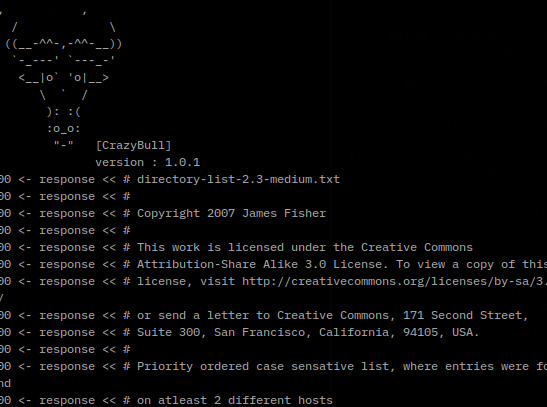

<h1>Una herramienta para encontrar directorio</h1> 
Con esta herramienta podras encontrar directorios ocultos en una web.
La herramienta hace una peticion HTTP GET a la direccion dada junto al 
wordlist utilizado, luego lanza una respuesta de conexion 
dependiendo de esta respuesta por parte del servidor el programa 
determina si el directorio existe o no. 

